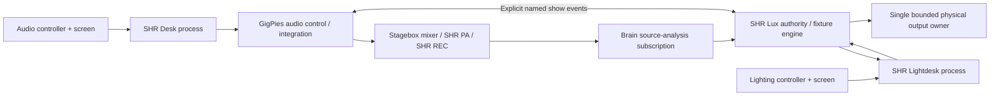

# SHR Lightdesk blueprint

Decision date: 2026-10-04. This owns the lighting surface plan. GigPies is the
complete product: two human-operated consoles, with automation inside them.
Neither a lighting automaton nor an audio automixer is the entire Brain.

## Product and module map

One Brain runs two independent native applications, normally one Full-HD
1920×1080 monitor and one MIDI keyboard controller per desk. SHR Desk is the
audio surface; SHR Lightdesk is the lighting surface. Ordinary keyboard input
must provide every operation even with controllers disconnected. The Stagebox
keeps audio, local protection, monitors and recording independent of these apps.

| Owner | Responsibility | Surface must not duplicate |
|---|---|---|
| GigPies | Show identity, module compatibility, launch/display/controller assignment, cross-system contracts, integration acceptance | Engine algorithms in other owners |
| SHR Desk | Audio navigation, selection, applied-state presentation, audio operator actions | Mixer/PA/FX/REC algorithms |
| SHR Lightdesk | Lighting screen state, selection, action translation, pending/confirmed presentation, recovery UI | Fixture evaluation, arbitration, cue clocks, effects, DMX encoding/output |
| SHR Lux | Lighting analysis and artistic direction, fixture capability/patch evaluation, programmer/playback/automation arbitration, cue/effect execution, final intent, output/fault policy | Audio mixing, owning Lightdesk's LEDs in integrated mode |
| SHR DAW / SHR FX | Proven controller/keyboard interaction and font references; their own workstation/effect engines | Their application state is not a shared desk framework |

SHR Lux's current 80×25 standalone UI and opt-in pad light-show remain its own
standalone features. Integrated operation uses an engine adapter with controller
LED output disabled/unclaimed. No sibling was changed by this task. Requirements
for those owners are recorded below and in GigPies' integration backlog.

## Existing work examined

The [capability matrix](CAPABILITIES.md) distinguishes runtime code from research.
Read GigPies README, STATUS, ARCHITECTURE, COMPONENTS, BRAIN_CONSOLE_PLAN,
AUDIO_TRANSPORT and AUDIO_HARDWARE; SHR Desk README and all six design/status
plans; Lux README, idea, architecture, roadmap, DMX/fixture, analysis/MIDI notes,
design-study map and design-to-engine specification; DAW controller interface,
profiles, LED plan and workspace handoff; FX interface and working agreements.

Lux has causal recorded-source features, a show policy, a composed preview and a
bounded opt-in MIDI output worker. Its `dmx.rs` validates addresses and encodes a
uDMX range request; that is not a complete fixture personality or physical output
engine. Its fixture patch/manual-operation roadmap is still proposed. Retain its
hold-first composition research, separation of color/intensity and uncertain
musical estimates. Do not transplant the timer-driven pad preview into Lightdesk.
Lux has no selected project license; no Lux code is copied here.

Desk's actual 12×24 bitmap font and MIT scene/SVG primitives provide a working
visual basis. DAW has model/preset-specific controller evidence, including mkII
and MiniLab 3 references and ambiguous pad/key messages. FX supplies useful
browse/edit/confirm/back, detached drafts, pickup and held-button recovery ideas.
These are references, not proof of the second physical controller's identity.

## First implemented slice and code boundaries

The first slice answers: can a human select a small rig, build and store a look,
play it, override even an intensity to zero, see the controlling source, release
intentionally and recover an uncertain request? It works entirely offline.

| File | Responsibility |
|---|---|
| `src/model.rs` | Local typed capability/snapshot/command model and `Authority` seam |
| `src/surface.rs` | Local selection/pages, one pending request, release preview and semantic actions |
| `src/controller.rs` | Synthetic MIDI profile, identity gate, press edges, pickup and relative translation |
| `src/simulator.rs` | Explicit mock authority, static look arbitration and storage fixtures |
| `src/render.rs` | Scene primitives, PSF glyphs, seven 1080p drafts, SVG/PPM review backends |
| `src/main.rs` | Offline interactive loop, event injection and gallery |

The mock has no clock, fade interpolation, effects, real fixture profiles, DMX,
audio analysis or persistence. Its two playback slots and copied palettes exist
to test the surface. They are **not completed Lux engine work**. A real adapter
will implement an agreed Lux protocol, use engine-generated release previews,
and replace the simulator in the executable. The surface never resolves lighting
itself; `Authority::preview_release` calculates a preview in the current adapter.
Do not serialize these in-process enums as an undocumented wire protocol.

Start with one crate; no empty packages and no sibling path dependencies. Reuse
exact font bytes, palette, 12×24 grid and action vocabulary now. The narrow PSF and
primitive adaptation is attributed in THIRD_PARTY. After both desks have native
backends, a small versioned font/scene package is justified by two real consumers.
A common device-profile parser or typed contract package needs accepted schemas
first. Keep lighting selection, attribute ownership, cue editing and arbitration
separate from audio channels, faders, mutes and automation.

## Two desks on one Brain

GigPies assigns persistent roles `audio-desk` and `lighting-desk`, never display
index 0/1 or ALSA card number. Store connector identity plus EDID make/model/serial
where reliable, desired mode and operator assignment in private local settings.
EDID duplicates or missing serials require a visible assignment screen with role
labels, not automatic swapping. Reconnect restores the role to its verified
monitor. Missing lighting monitor leaves audio's window untouched; offer an
explicit lighting window on the remaining screen without stealing focus. A
monitor event is not an engine command. Scaling/rotation/reduced-resolution
fallback preserve selection and show a readable recovery/status view.

MIDI goes to the assigned process regardless of desktop keyboard focus. Ordinary
keyboard input follows the focused application. There is no promise of two
independent desktop keyboard foci; if two ordinary keyboards are later required,
that needs a seat/input design. Selection, page, pending requests and application
restart are independent. Controller assignment uses an atomic ownership registry
and per-device lock, with **per-desk input and LED workers**; no shared hot event
loop through which a lighting backlog can delay audio input. A small coordinator
may manage assignments, but is not a real-time data relay or engine clock.

Both clients attach to a shared show UUID and compatible module versions, exposing
engine epoch/revision, freshness and role in their headers. A mismatch gives a
read-only diagnostic, not an implicit recall. UI restart reattaches; it never
loads an old show into the engine. Persist layout/controller roles separately
from engine show data. Lux preserves holds, active playback and blackout across
surface failure. Full engine restart/output recovery needs the declared show
policy; surface state is never the authority for rearming.

Cross-system cues are named, explicitly enabled show events with event ID,
origin, show UUID, sequence, target scope and requested effective time. Lighting
GO does not change audio/recording by default; audio GO does not grant blackout or
movement. Deliver each event once per engine epoch with bounded retry/expiry and
individual acknowledgments. Report partial completion; do not pretend two
engines form an atomic transaction. Later prepare/commit support needs both
owners. Surface keys are consumed, never forwarded to an instrument.

Audio subscriptions come from GigPies' existing source-frame transport/analysis
services, not Lightdesk opening another audio device. Lux receives named sources,
epoch/frame or declared timestamp relationship, confidence and freshness. Dropped
or uncertain analysis suppresses new automatic transitions and follows the agreed
fallback; it cannot pretend unplugging is musical silence. Shared health summarizes
other modules without making lighting responsible for PA protection or recording.

## Resource and responsiveness targets — unverified

Target acceptance profile: both 1920×1080 surfaces, 60 Hz while active; audio desk
36 visible/available channel identities, selected analysis at 20–30 Hz; Lightdesk
32 declared fixtures, 8 active playbacks in the **future** engine, 30 Hz stage
telemetry. Also run the declared GigPies source/FX/recording workload. Today's
8-fixture/2-slot simulator does not certify that profile. Pi assignment remains
undecided even though development ran on rpi5.

| Combined target | Gate / measurement |
|---|---|
| Two surface processes + their input/LED workers ≤1 CPU core sustained | Aggregate CPU ≤100% on Linux's one-core scale (25% of a four-core host); ten-minute authorized run |
| Render CPU p99 ≤4 ms per surface, aggregate ≤8 ms per refresh | Instrument both, report p50/p95/p99/max and dropped frames |
| Aggregate GPU frame work p99 ≤8 ms, 60 Hz present | GPU timing when available, compositor/presentation included separately |
| Combined surface PSS ≤384 MiB; graphics allocations ≤128 MiB | Report PSS and shared GPU accounting without double counting |
| Whole Brain working set ≤1.4 GiB on a 2 GiB candidate; ≥256 MiB available | Include Lux/FX/analysis/transport/desktop; no swapping under declared show workload |
| Whole Brain sustained CPU ≤60% of four cores | Remaining margin for bursts/OS; per-worker deadline evidence overrides averages |
| Local MIDI dispatch p99 ≤5 ms; visible response p99 ≤33 ms, p99.9 ≤100 ms | Input receipt → action → displayed confirmation/pending; distinguish engine/physical latency |
| Local control ACK p99 ≤20 ms at normal load | Measure separately from cue timing and output-frame/physical delay |
| Lighting overload adds no audio control timeout or audio deadline miss | Compare audio-only baseline; recording continuity and protection remain intact |

Bound each input queue and per-frame event work. Coalesce replaceable values and
telemetry; discrete GO/release/blackout receive success or visible busy/refusal,
never silent loss. Lower stage animation to 30/15 Hz, then disable decorative
previews before delaying controls. No raw-audio buffers enter either renderer.
Separate input, UI, analysis, control authority and physical output responsibilities.
Do not lower audio protection or hide missed targets to claim the two screens fit.
All combined-load and display/GPU acceptance is a separately scoped hardware gate.

## Delivery gates and required sibling work

1. **L0 (this checkpoint):** source study, boundaries, offline operator loop,
   state/controller/recovery tests and seven state-driven screen drafts.
2. **L1 (next):** one native window using this scene/font model; choose winit/wgpu
   in a measured prototype alongside Desk's planned backend. Implement actual
   focus, typed editors, keyboard shortcuts, modal confirmations, scrolling and
   complete controller-only navigation. Verify renderer device loss offline first.
3. **LX1 (SHR Lux, requires separate write scope):** versioned patch and fixture
   capabilities, programmer and persistent holds, static cues/palettes, explicit
   per-attribute arbitration/master/blackout and source traces. Engine-owned
   previews, timed release and null output sink; no physical arming yet.
4. **GI1 (GigPies):** shared show/role registry, module handshake, independent
   controller ownership/display assignment and source-analysis subscriptions.
   Read-only Lightdesk→Lux adapter before any control write.
5. **L2/LX2:** contract fixtures on both sides; real static manual programming,
   cue editing and timing, live-safe persistence/recovery and approved automation
   grants. Add effects only through Lux descriptors and execution.
6. **H1:** separately authorized second-controller and two-monitor identity,
   mapping, disconnect/focus/restart, LED exclusivity and usability acceptance.
7. **H2:** known fixture profiles, output-loss policy, bounded physical worker,
   explicit arming/recovery and physical low-level acceptance in Lux/GigPies.
8. **H3:** combined load/thermal/deadline and complete manual show exercise with
   automation absent, followed by ASSIST and scoped AUTO acceptance.

A rendered stage, an accepted mock request and a green pad are three different
observations; none establishes actual light. See [contract](CONTROL_CONTRACT.md)
for source attribution and output evidence, and [status](STATUS.md) for exact gates.
