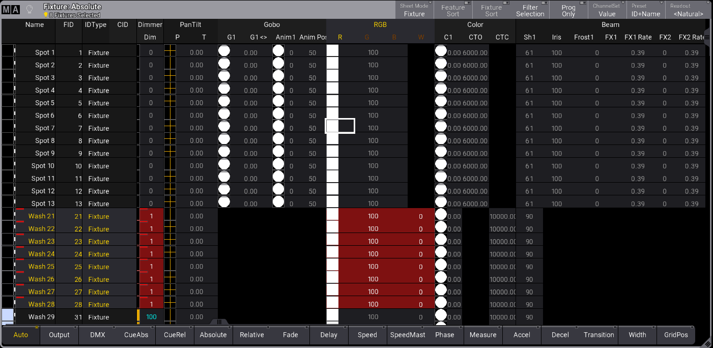

# MA Lighting grandMA3: Fixture Sheet, absolute mode

[Reference index](../README.md) · [Offline gallery](../index.html)

- Source: [MA Lighting grandMA3 manufacturer material](https://help.malighting.com/grandMA3/2.4/HTML/operate_fixture_sheet.html)
- Asset: [original image or manual](https://help.malighting.com/grandMA3/2.4/Storage/grandma3-user-manual-publication/img/window_fixture-sheet_absolute-mode.PNG)
- Version/context: Manual 2.4
- Locator: Complete source image
- Stored dimensions: 1401 × 684 px
- Acquisition and visual inspection: 2026-10-06
- Processing: Unmodified manufacturer PNG
- SHA-256: `3c4aabfa6c1224f3842a8c217ca5d67ea45ddaec44969114d2578f20aa6d07ab`
- Rights: third-party manufacturer reference; no open redistribution licence established. See [source register](../SOURCES.md).

## Screen purpose

Inspect fixture identities and multiple attribute families in a dense table, with a separately chosen value layer.

## Visible layout

A title/control row identifies Fixture: Absolute and 8 Fixtures Selected. Identity columns on the left are Name, FID, IDType and CID. Attribute headers group Dimmer, PanTilt, Gobo, RGB, Color and Beam. Spot rows occupy the upper portion and Wash rows the lower portion. A fixed bottom toolbar exposes Auto, Output, DMX, CueAbs, CueRel, Absolute, Relative, Fade, Delay, Speed and further layers.

## Visible controls and data

Wash 21–28 have yellow identity text and red attribute cells, while Spot identities are pale. An RGB cell has a white focus outline. Pan/tilt cells contain small yellow crosshair symbols; gobo/colour cells contain graphical circular swatches. Several attributes are blank or black for the wash rows. The far-right and bottom extent visibly clip additional data, so scrolling is part of the table design.

## Visual hierarchy and state markings

Dark alternating rows and grey headers provide structure. Yellow marks selection-related information, red emphasises a subset of values, and white outlines distinguish cell focus. Those marks are not interchangeable: a selected fixture, an edited value and the focused cell are different visual objects. The screenshot does not explain every colour’s complete semantics.

## Workflow supported by the reference

Choose the fixture subset and displayed layer, then inspect the relevant attribute family. The title and layer toolbar make table context visible. This is not a stage map, and displayed values are not proof of physical output.

## Design implications for our desk

Borrow fixed fixture identity, capability-aware grouped columns and explicit layer/source context for Lightdesk. Add textual owner and applied/pending/held state, and a selected-attribute inspector with units. Keep focus independent of selection and programming. Provide a smaller readable default set rather than forcing the full large-system sheet into the band rig.

## Evidence limits

Manual 2.4, complete 1401×684 manufacturer PNG. Black cells may reflect capability or view state; do not guess unsupported attributes from colour alone. No physical fixture, DMX feedback or large-system operation was tested.

The observations describe the retained picture. Design implications are proposals, not accepted product requirements or proof of engine capability.
