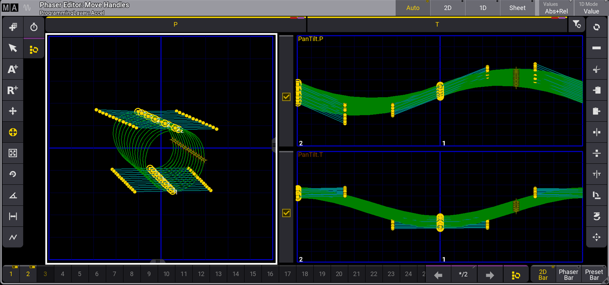

# MA Lighting grandMA3: Phaser Editor, Auto view

[Reference index](../README.md) · [Offline gallery](../index.html)

- Source: [MA Lighting grandMA3 manufacturer material](https://help2.malighting.com/grandMA3/2.3/HTML/phaser_editor.html)
- Asset: [original image or manual](https://help2.malighting.com/grandMA3/2.3/Storage/grandma3-user-manual-publication/img/window_phaser-editor-auto_v1-9a.png)
- Version/context: Manual 2.3; illustration filename v1-9a
- Locator: Complete source image
- Stored dimensions: 1600 × 751 px
- Acquisition and visual inspection: 2026-10-06
- Processing: Unmodified manufacturer PNG
- SHA-256: `f5ed671984607156976978d10688d7937ea3bd8de2f10964d9341c07c4effce8`
- Rights: third-party manufacturer reference; no open redistribution licence established. See [source register](../SOURCES.md).

## Screen purpose

Inspect a multi-fixture movement effect as both a two-dimensional path and separate parameter curves.

## Visible layout

The title says Phaser Editor: Move Handles and Programming Layer: Accel. Auto, 2D, 1D and Sheet selectors sit at the upper right. A large left graph shows a family of looping paths on a blue grid. Two stacked right graphs labelled PanTilt.P and PanTilt.T show corresponding parameter curves. Vertical toolbars frame both sides, and a long step selector runs along the bottom.

## Visible controls and data

Yellow points and larger outlined handles mark editable positions. Green curves and cyan connecting lines distinguish trajectory components. Bottom steps 1 and 2 have yellow labels, followed by many numbered slots, arrows and 2D Bar / Phaser Bar / Preset Bar controls. The left plot has a strong white border, while the right graphs show checkbox-like controls beside their axes.

## Visual hierarchy and state markings

Most of the screen is black plotting space; bright blue axes, green curves and yellow handles form a technical editing language. The active Auto selector is yellow. The many unlabeled tool icons depend on familiarity and consume permanent width. There are no clear real-world distance or angle units visible in the graph.

## Workflow supported by the reference

Select a programming layer and step, compare combined motion with its component curves, then edit handles. The image shows effect authoring data, not live moving-light trajectories or stage collision checks.

## Design implications for our desk

For a later Lightdesk effect editor, separate spatial shape from per-attribute/time detail while preserving one fixture/step context. Label units, phase and selection, and offer keyboard alternatives. Prefer a simpler first editor until Lux owns effect timing and evaluation; do not implement trajectories inside the surface.

## Evidence limits

Manual 2.3 reuses a v1-9a-named illustration, 1600×751. This is historical UI reference. The plot does not establish actual pan/tilt calibration, fixture movement, motor safety or effect execution.

The observations describe the retained picture. Design implications are proposals, not accepted product requirements or proof of engine capability.
