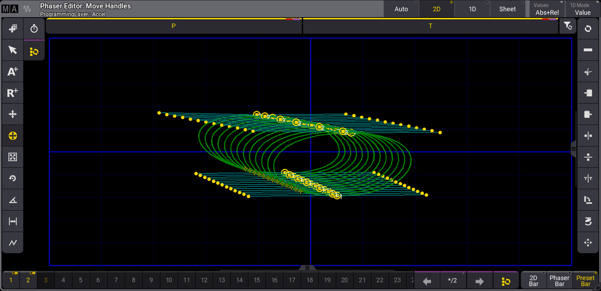

# MA Lighting grandMA3: Phaser Editor, 2D view

[Reference index](../README.md) · [Offline gallery](../index.html)

- Source: [MA Lighting grandMA3 manufacturer material](https://help2.malighting.com/grandMA3/2.3/HTML/phaser_editor.html)
- Asset: [original image or manual](https://help2.malighting.com/grandMA3/2.3/Storage/grandma3-user-manual-publication/img/window_phaser-editor-2d_v1-9.png)
- Version/context: Manual 2.3; illustration filename v1-9
- Locator: Complete source image
- Stored dimensions: 1600 × 776 px
- Acquisition and visual inspection: 2026-10-06
- Processing: Unmodified manufacturer PNG
- SHA-256: `7f163b82d8200af94bdc40526cbc465dc089600d1de3b9ac19851e89e2f4888c`
- Rights: third-party manufacturer reference; no open redistribution licence established. See [source register](../SOURCES.md).

## Screen purpose

Compare a focused two-dimensional movement editor with the split Auto view of the same example.

## Visible layout

The same Move Handles title, Accel programming layer and side toolbars remain. The 2D selector is highlighted and a single wide graph replaces the split spatial/parameter layout. P and T labels remain above the graph. The bottom step strip and bar selectors are preserved, so the navigation context stays stable while the central workspace changes.

## Visible controls and data

A family of green loops spans the middle of the plot, with yellow handle points on upper and lower boundaries and cyan connecting segments. Strong blue horizontal/vertical axes cross the canvas. The bottom shows numbered step slots 1–24, navigation arrows, a */2 field and bar-mode buttons. The drawing has no stage fixture icons, cue names or device/output health readout.

## Visual hierarchy and state markings

The graph has much more horizontal room than in Auto mode, making spatial relationships easier to see. Yellow indicates active mode and handles, and blue marks axes. The many trajectories are still dense; individual fixture labels are missing, making it difficult to identify whose path is being changed solely from this image.

## Workflow supported by the reference

Switch the same effect context into a spatially focused view for path editing, then return to component/detail views for exact control. This pair demonstrates view-mode changes without needing to rebuild the entire workspace.

## Design implications for our desk

Use stable context and mode switches when adding graphical tools to Lightdesk. A focused canvas should preserve fixture subset, attribute, step and owner, with an exact-value inspector available. Do not present an effect path as a calibrated stage preview. Retain a simple list/editor for ordinary band use instead of making a phaser graph the default.

## Evidence limits

Manual 2.3, v1-9-named PNG, 1600×776. Image labels do not provide physical units or timeline calibration. It complements the Auto figure; it is not a separate tested effect or an implemented Lux capability.

The observations describe the retained picture. Design implications are proposals, not accepted product requirements or proof of engine capability.
