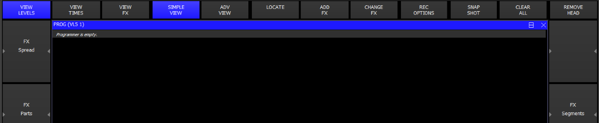

# ChamSys MagicQ: Empty Programmer, Levels view

[Reference index](../README.md) · [Offline gallery](../index.html)

- Source: [ChamSys MagicQ manufacturer material](https://docs.chamsys.co.uk/magicq/1.9.7.x/manual/programmer.html)
- Asset: [original image or manual](https://docs.chamsys.co.uk/magicq/1.9.7.x/manual/_images/progwindow.png)
- Version/context: Manual 1.9.7.x
- Locator: Complete source image
- Stored dimensions: 1225 × 253 px
- Acquisition and visual inspection: 2026-10-06
- Processing: Unmodified manufacturer PNG
- SHA-256: `4b83c3ef43af932fc53dbf6a6568127ead253939dc9fb7d4d77580b8d8db2d97`
- Rights: third-party manufacturer reference; no open redistribution licence established. See [source register](../SOURCES.md).

## Screen purpose

Document a deliberate empty programmer state, including the commands that remain visible around it.

## Visible layout

A wide top row contains View Levels, View Times, View FX, Simple View, Adv View, Locate, Add FX, Change FX, Rec Options, Snap Shot, Clear All and Remove Head. View Levels and Simple View are blue. A blue PROG title bar sits below. The black main area contains the explicit sentence Programmer is empty. Narrow grey control regions frame the left and right edges.

## Visible controls and data

FX Spread and FX Parts are labelled on the left; FX Segments appears on the right. The main table is absent because there is no programmer data. The large empty black region is therefore meaningful state, rather than a failed load inferred from missing values. Remove Head and Clear All remain visually distinct commands.

## Visual hierarchy and state markings

Blue selected tabs and a blue title bar dominate an otherwise grey/black interface. Large rectangular softkeys provide stable locations. The empty-state message is small and italic, so it is easy to miss even though it prevents a major interpretation error. The low 253-pixel height is a source crop, not necessarily the full console display.

## Workflow supported by the reference

Open the programmer, identify its current view, and inspect whether any data exists before recording or clearing. The manual describes separate Levels, Times and FX views; this figure specifically demonstrates the empty Levels view.

## Design implications for our desk

Lightdesk should distinguish empty programmer, no selection, unavailable state and disconnected provider in plain text. Keep the main control locations stable across those states. Disable writes when authority/data is absent, while allowing harmless navigation. Avoid filling an empty view with illustrative values that look applied.

## Evidence limits

Manual 1.9.7.x, 1225×253 PNG. The PROG title includes VLS 1, which is context rather than a reliable software-version label. Only this cropped window is documented; no playback or output state can be inferred.

The observations describe the retained picture. Design implications are proposals, not accepted product requirements or proof of engine capability.
