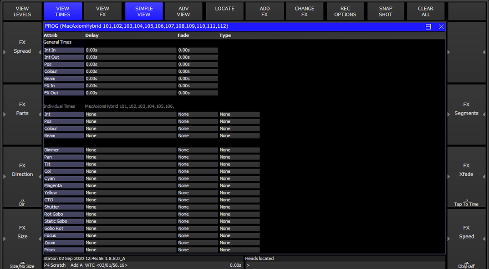

# ChamSys MagicQ: Programmer Times

[Reference index](../README.md) · [Offline gallery](../index.html)

- Source: [ChamSys MagicQ manufacturer material](https://docs.chamsys.co.uk/magicq/1.9.7.x/manual/programmer.html)
- Asset: [original image or manual](https://docs.chamsys.co.uk/magicq/1.9.7.x/manual/_images/progtimes.png)
- Version/context: Manual 1.9.7.x
- Locator: Complete source image
- Stored dimensions: 1074 × 592 px
- Acquisition and visual inspection: 2026-10-06
- Processing: Unmodified manufacturer PNG
- SHA-256: `46e2ed7d185f4b20886addb9d284e9244d8de0de6af639ac665db45bd63487c4`
- Rights: third-party manufacturer reference; no open redistribution licence established. See [source register](../SOURCES.md).

## Screen purpose

Show general timing and individual attribute timing in the same programmer context.

## Visible layout

View Times is blue in the same top softkey row as the empty programmer example. The PROG title lists MacAxiomHybrid fixtures 101–112. A table begins with Attrib, Delay, Fade and Type. General Times rows for Int In, Int Out, Pos, Colour, Beam, FX In and FX Out appear above a second Individual Times region. Side control areas remain on both sides, with a command/status band at the bottom.

## Visible controls and data

General delay/fade values read 0.00s. Individual timing rows show None for attributes including Dimmer, Pan, Tilt, colour components, shutter, gobos, focus, zoom and prism. A 0.00s value and Heads located text appear in the bottom band. The screenshot itself displays station/date/build text including 1.8.8.0_A, older than the enclosing 1.9.7.x manual.

## Visual hierarchy and state markings

Blue selected navigation and grey table headings remain stable between views. General rows and individual rows are separated by section labels and spacing. Seconds are explicit, and None is visibly different from 0.00s. Large unused black space preserves the table’s simple left alignment.

## Workflow supported by the reference

Review timing at an attribute-family level, then inspect per-attribute overrides. The image demonstrates the distinction between a general zero-time setting and an absent individual override; it does not show a fade running.

## Design implications for our desk

Lightdesk should separate inherited/unset timing from an explicit zero duration, and keep fixture scope visible during timing edits. Start with a small, readable set of intensity/colour/position times rather than the entire advanced matrix. Lux must own timing execution, preview and applied-state acknowledgement.

## Evidence limits

Manual 1.9.7.x reuses this older-build screenshot, 1074×592. Timing values are illustrative. No live cue, fade duration, scheduling accuracy or moving-light behaviour was verified.

The observations describe the retained picture. Design implications are proposals, not accepted product requirements or proof of engine capability.
