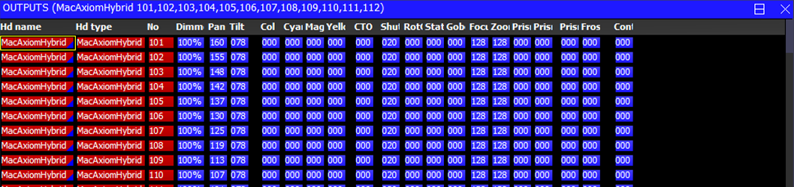

# ChamSys MagicQ: Head output values

[Reference index](../README.md) · [Offline gallery](../index.html)

- Source: [ChamSys MagicQ manufacturer material](https://docs.chamsys.co.uk/magicq/1.9.7.x/manual/outputs_windows.html)
- Asset: [original image or manual](https://docs.chamsys.co.uk/magicq/1.9.7.x/manual/_images/outputsheads.png)
- Version/context: Manual 1.9.7.x
- Locator: Complete source image
- Stored dimensions: 1057 × 250 px
- Acquisition and visual inspection: 2026-10-06
- Processing: Unmodified manufacturer PNG
- SHA-256: `e061580fe11ff34f4346eaf98aff5b5df1462f40e2377e4dcee0c711c2d8d534`
- Rights: third-party manufacturer reference; no open redistribution licence established. See [source register](../SOURCES.md).

## Screen purpose

Inspect current per-head attribute values separately from the programmer’s editable data.

## Visible layout

A blue OUTPUTS title lists MacAxiomHybrid fixtures 101–112. Identity columns Hd name, Hd type and No precede Dim, Pan, Tilt, Col, colour components, CTO, shutter, gobo, focus, zoom, prism and further abbreviated columns. Repeated rows occupy a shallow horizontal window; the bottom row is cut by the image boundary.

## Visible controls and data

Fixture numbers begin at 101. Dimmer reads 100% across the visible rows, Pan changes from row to row, Tilt remains 078, and many raw-looking attributes use three-digit values such as 000, 020, 128 and 255. Red identity cells contrast with blue value cells. Not every numeric field uses the same unit or scaling.

## Visual hierarchy and state markings

Compact white text, red identity blocks and blue parameter blocks create strong row/column distinction. It is efficient for comparing values but not self-explanatory for someone unfamiliar with the abbreviations. The lack of expanded units and source/owner text makes a dedicated inspector valuable.

## Workflow supported by the reference

Inspect output values for a named group, then consult the relevant attribute or output-source view for diagnosis. The manual distinguishes head values from raw/controlling-playback and DMX views; this figure is the head-value table. It must not be labelled as physically verified DMX.

## Design implications for our desk

Lightdesk should retain separate Programmer and Output/source inspection views. Give each attribute its declared unit and capability, and label base/post-master/submitted/physical-feedback boundaries. Keep identity fixed during horizontal scrolling and provide a selected-cell source explanation. Missing telemetry must remain unavailable rather than zero.

## Evidence limits

Manual 1.9.7.x, 1057×250 PNG. The shallow crop cuts data, and displayed numeric output does not prove fixture response, valid patch adjustments or transport delivery. Source ownership is not visible in this particular image.

The observations describe the retained picture. Design implications are proposals, not accepted product requirements or proof of engine capability.
