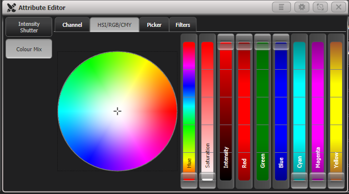

# Avolites Titan: HSI/RGB/CMY Attribute Editor

[Reference index](../README.md) · [Offline gallery](../index.html)

- Source: [Avolites Titan manufacturer material](https://manual.avolites.com/docs/17.0/controlling-fixtures/changing-fixture-attributes/)
- Asset: [original image or manual](https://manual.avolites.com/assets/images/Attribute-Editor-HSI-RGB-CMY-7b1c54520b9a1a19f6ff9f58eb750be9.png)
- Version/context: Manual 17.0
- Locator: Complete source image
- Stored dimensions: 702 × 390 px
- Acquisition and visual inspection: 2026-10-06
- Processing: Unmodified manufacturer PNG
- SHA-256: `627051f6113dd459f410d679c668d5653f12ddf77efc3d7e0ec8bf19bec11e1a`
- Rights: third-party manufacturer reference; no open redistribution licence established. See [source register](../SOURCES.md).

## Screen purpose

Combine an intuitive colour picker with separately named component controls.

## Visible layout

The Attribute Editor has Channel, HSI/RGB/CMY, Picker and Filters tabs across the top. A narrow left selector contains Intensity Shutter and Colour Mix. A large circular colour disk occupies the lower-left centre. Nine tall sliders line the right: Hue, Saturation, Intensity, Red, Green, Blue, Cyan, Magenta and Yellow. Window utility buttons sit in the title bar.

## Visible controls and data

A crosshair sits near the pale centre of the disk. Each slider has its component name written vertically and a gradient that visually describes its range. RGB handles sit near the top while several other handles sit near the bottom. The figure contains no readable numeric component values or selected-fixture identity.

## Visual hierarchy and state markings

The saturated colour disk dominates a dark-grey panel. Bright slider gradients communicate components without requiring a legend, but narrow vertical labels are difficult to read quickly. The disk centre suggests low saturation; it is not a calibrated physical-white measurement. Multiple colour models are shown together and require a clear policy for linked edits.

## Workflow supported by the reference

Choose Colour Mix, pick a region or adjust components, and inspect the resulting colour through the console’s fixture-aware controls. The image shows controls, not the conversion rules between HSI, RGB and CMY or the response of a particular luminaire.

## Design implications for our desk

A Lightdesk colour editor can offer a spatial picker beside exact named values and a full keyboard/controller route. Keep selected fixtures and supported channels visible, distinguish requested/applied colour, and show mixed values for heterogeneous selection. Colour conversion and capability handling belong in Lux, not the surface.

## Evidence limits

Titan 17.0 manual, complete 702×390 PNG. The graphic is conceptual colour reference. It cannot establish spectrum, gel matching, white calibration, camera appearance or actual emitted light.

The observations describe the retained picture. Design implications are proposals, not accepted product requirements or proof of engine capability.
