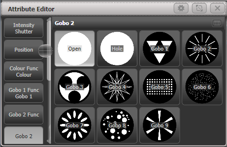

# Avolites Titan: Gobo Attribute Editor

[Reference index](../README.md) · [Offline gallery](../index.html)

- Source: [Avolites Titan manufacturer material](https://manual.avolites.com/docs/17.0/controlling-fixtures/changing-fixture-attributes/)
- Asset: [original image or manual](https://manual.avolites.com/assets/images/Gobo-Selection-5dd6020e72c35dc36d3643083a59d608.png)
- Version/context: Manual 17.0
- Locator: Complete source image
- Stored dimensions: 461 × 299 px
- Acquisition and visual inspection: 2026-10-06
- Processing: Unmodified manufacturer PNG
- SHA-256: `edf0b40127b67d657d2aacc07ee3c0a0e4083eaba3cd235daa80042d1208cea9`
- Rights: third-party manufacturer reference; no open redistribution licence established. See [source register](../SOURCES.md).

## Screen purpose

Show fixture-specific discrete choices as labelled thumbnails rather than unexplained numeric ranges.

## Visible layout

The Attribute Editor uses a vertical category rail on the left and a three-column thumbnail grid on the right. The rail includes Intensity Shutter, Position, Colour Func/Colour, Gobo 1 Func/Gobo 1, Gobo 2 Func/Gobo 2 and Gobo 2. The main area is headed Gobo 2, with a narrow scrollbar between navigation and content.

## Visible controls and data

The grid has Open, Hole and Gobo 1–9 choices. Open and Hole use pale circular thumbnails; the numbered gobos show geometric or textured patterns on black backgrounds. Text labels sit over the thumbnails. A small utility/grid icon appears beside the section title; title-bar buttons include settings and close.

## Visual hierarchy and state markings

Large high-contrast thumbnails make pattern differences understandable before their names are read. Grey rounded tile backgrounds separate options. Labels can overlap busy graphics, which would reduce readability on small displays. Several similar category names in the left rail require explicit selected-group highlighting.

## Workflow supported by the reference

Select the relevant fixture attribute, browse its supported discrete options, then choose the intended pattern. The figure does not show whether selection applies immediately or whether the fixture has acknowledged a mechanical wheel change.

## Design implications for our desk

Use descriptor-backed labelled choices in Lightdesk for gobos, shutter modes and other discrete controls. Show the selected fixture/capability and distinguish requested, pending and applied options. For fixtures without gobos, omit or disable the editor rather than showing generic patterns. Keep a text-list route for keyboard use and unknown/missing thumbnails.

## Evidence limits

Titan 17.0 manual, 461×299 PNG. These are illustrative gobo icons. They do not establish a fixture personality, wheel indexing, rotation speed, projected sharpness or any product asset reuse permission.

The observations describe the retained picture. Design implications are proposals, not accepted product requirements or proof of engine capability.
