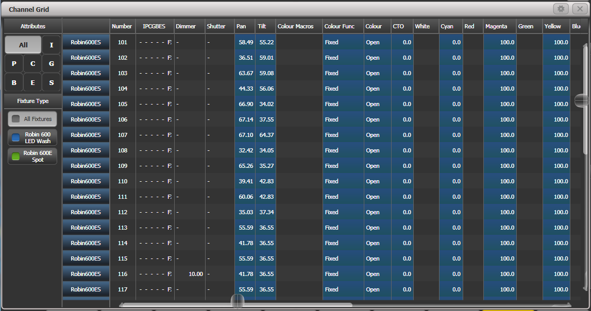

# Avolites Titan: Channel Grid

[Reference index](../README.md) · [Offline gallery](../index.html)

- Source: [Avolites Titan manufacturer material](https://manual.avolites.com/docs/17.0/controlling-fixtures/viewing-and-editing-fixture-values/)
- Asset: [original image or manual](https://manual.avolites.com/assets/images/Channel-Grid-f99c103a94fde45c6fd6caac2d277baf.png)
- Version/context: Manual 17.0
- Locator: Complete source image
- Stored dimensions: 1147 × 604 px
- Acquisition and visual inspection: 2026-10-06
- Processing: Unmodified manufacturer PNG
- SHA-256: `9dc229730f5079048c361204bd95898af903fe3a891f9cf6756c0fddfa59fbd7`
- Rights: third-party manufacturer reference; no open redistribution licence established. See [source register](../SOURCES.md).

## Screen purpose

Inspect fixture attribute values in a table with quick filters for attribute families and fixture type.

## Visible layout

A left sidebar offers All and I/P/C/G/B/E/S attribute buttons, followed by Fixture Type filters such as All Fixtures, Robin 600 LED Wash and Robin 600E Spot. The main grid begins with fixture type, Number and IPCGBES status, followed by Dimmer, Shutter, Pan, Tilt, colour functions/components and further fields. Horizontal and vertical scrollbars show that the table exceeds its viewport.

## Visible controls and data

Visible fixtures are Robin600ES numbered 101–117. Pan and Tilt have decimal values; colour cells include Fixed, Open and 0.0/100.0 entries. One visible row has Dimmer 10.00 while others show dashes in that column. A narrow IPCGBES field contains small letters/marks. A dash is visually different from an explicit numeric zero.

## Visual hierarchy and state markings

Blue-filled value columns alternate with grey/dark cells. Fixture-type filter squares use separate blue/green category colours. Pale headers and strong vertical divisions improve alignment, but long attribute names and distant identity columns make horizontal scrolling a usability concern.

## Workflow supported by the reference

Filter by fixture family and attribute group, then inspect individual values. The manual offers several grid views; this image should not be treated as every layer or ownership view. A populated cell is not proof of physical output.

## Design implications for our desk

Lightdesk can borrow quick capability/group filtering, fixed fixture identity and explicit missing-versus-zero representation. Provide a selected-attribute inspector with units and source, and avoid requiring sideways scrolling for the most-used intensity/colour/position values. Selection/filter changes must remain harmless until a separate edit action.

## Evidence limits

Titan 17.0 manual, 1147×604 PNG. The far-right columns are clipped. Cell colours and IPCGBES marks require documented semantics before copying. Do not infer tracking, programmer priority or fixture response from this grid alone.

The observations describe the retained picture. Design implications are proposals, not accepted product requirements or proof of engine capability.
