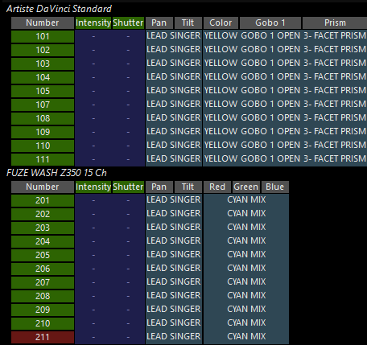

# Obsidian ONYX: Programmer, fixture-specific attribute groups

[Reference index](../README.md) · [Offline gallery](../index.html)

- Source: [Obsidian ONYX manufacturer material](https://support.obsidiancontrol.com/Content/Onyx_Manual/Programming/Manipulating_Fixtures/The_Programmer.htm)
- Asset: [original image or manual](https://support.obsidiancontrol.com/Content/assets/images/Screenshots/3.71/Programmer%203.71.png)
- Version/context: Unversioned online manual; historical screenshot filename 3.71
- Locator: Complete source image
- Stored dimensions: 456 × 429 px
- Acquisition and visual inspection: 2026-10-06
- Processing: Unmodified manufacturer PNG
- SHA-256: `f4468cd06b15bba99b7c280430cacc2135d63fcf64c793213f2a1296f84d7b0d`
- Rights: third-party manufacturer reference; no open redistribution licence established. See [source register](../SOURCES.md).

## Screen purpose

Demonstrate that the programmer’s table structure can differ by fixture type within one selected set.

## Visible layout

The cropped image contains two stacked sections. Artiste DaVinci Standard is above a table with Number, Intensity, Shutter, Pan, Tilt, Color, Gobo 1 and Prism. FUZE WASH Z350 15 Ch is above a second table with Number, Intensity, Shutter, Pan, Tilt, Red, Green and Blue. The upper fixtures run 101–111; lower fixtures run 201–211.

## Visible controls and data

Pan/Tilt cells refer to LEAD SINGER. The upper colour/gobo/prism cells show YELLOW, GOBO 1 OPEN and 3-FACET PRISM. The wash colour group refers to CYAN MIX. Intensity/shutter cells contain dashes. Most identity cells are green, while the final lower ID is red. This is populated symbolic programmer data, not an empty programmer.

## Visual hierarchy and state markings

Dark-blue value areas, grey headers and green/red IDs establish a compact table. Named references communicate meaning more directly than raw channel values, but some values extend across multiple attribute columns. The narrow crop cuts the right and lower edges and omits the surrounding programmer controls.

## Workflow supported by the reference

Inspect each fixture family’s supported attributes and named references. The screenshot supports capability-specific grouping; it does not explain every ID colour or reveal the full selection/programmer toolbar.

## Design implications for our desk

Lightdesk should avoid one fake universal fixture schema. Show only declared attributes and represent absent data differently from zero. Keep palette/reference names inspectable alongside numeric values when Lux supports them. Preserve selected versus last-selected versus masked distinctions through explicit text/marks rather than borrowed colour rules.

## Evidence limits

Current unversioned ONYX manual reuses a filename labelled 3.71; complete source crop 456×429. Historical illustration, not evidence of a current build’s appearance. The red ID colour cannot be fully interpreted from the crop alone.

The observations describe the retained picture. Design implications are proposals, not accepted product requirements or proof of engine capability.
