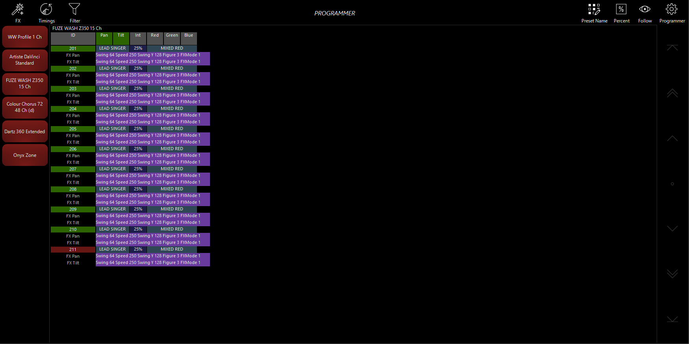

# Obsidian ONYX: Programmer, populated example

[Reference index](../README.md) · [Offline gallery](../index.html)

- Source: [Obsidian ONYX manufacturer material](https://support.obsidiancontrol.com/Content/Onyx_Manual/Programming/Manipulating_Fixtures/The_Programmer.htm)
- Asset: [original image or manual](https://support.obsidiancontrol.com/Content/assets/images/Screenshots/3.71/Programmer%20Example%203.71.png)
- Version/context: Unversioned online manual; historical screenshot filename 3.71
- Locator: Complete source image
- Stored dimensions: 1749 × 873 px
- Acquisition and visual inspection: 2026-10-06
- Processing: Unmodified manufacturer PNG
- SHA-256: `1b2dcd3f80775714965901c359170ab8eae71ec91f12aae552c4d6957dcdcb34`
- Rights: third-party manufacturer reference; no open redistribution licence established. See [source register](../SOURCES.md).

## Screen purpose

Inspect a full programmer window where base fixture values and effect details appear together.

## Visible layout

A top toolbar contains FX, Timings and Filter on the left and Preset Name, Percent, Follow and Programmer controls on the right. A vertical left rail groups fixture types. FUZE WASH Z350 15 Ch is the displayed table, with ID, Pan, Tilt, Int, Red, Green and Blue headers. Most of the wide window remains empty black; a right-side vertical rail provides scrolling/navigation symbols.

## Visible controls and data

Fixtures 201–211 show LEAD SINGER, 25% and MIXED RED. Under each fixture, purple FX Pan and FX Tilt rows list parameters such as Swing 64, Speed 250, Swing Y 128, Figure 3 and FXMode 1. ID 211 is red while others are green. The example therefore shows effect subrows separately from the fixture’s ordinary values.

## Visual hierarchy and state markings

Purple effect rows distinguish a second information layer from blue base-value rows. Named references and percent values coexist, with high-density text clustered in the left third of the window. Large empty space makes the content readable but suggests room for a selected-value/owner inspector. The icons need labels or learned familiarity.

## Workflow supported by the reference

Filter/select a fixture family, inspect its base look, and expand or read associated effect rows. The image does not show a live effect cursor, physical motion, or how edits become recordable.

## Design implications for our desk

Lightdesk can keep effect membership visible under a fixture while reserving a detail panel for exact parameters, scope and source. Distinguish base look from active effect contribution and programmer hold. Do not duplicate Lux’s effect evaluation, and avoid exposing unsupported controls merely because the reference has them.

## Evidence limits

Unversioned ONYX manual, historical 3.71-named PNG, 1749×873. Named presets and effect parameters are illustrative. This figure provides layout evidence only, without timing, physical movement or live output verification.

The observations describe the retained picture. Design implications are proposals, not accepted product requirements or proof of engine capability.
