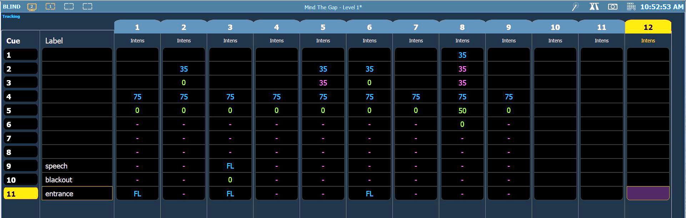

# ETC Eos: Blind cue tracking sheet

[Reference index](../README.md) · [Offline gallery](../index.html)

- Source: [ETC Eos manufacturer material](https://www.etcconnect.com/uploadedFiles/Main_Site/Documents/Public/Video_Tutorial/Eos_Family_L1_Essentials_v3.3.pdf)
- Asset: [original image or manual](https://www.etcconnect.com/uploadedFiles/Main_Site/Documents/Public/Video_Tutorial/Eos_Family_L1_Essentials_v3.3.pdf)
- Version/context: Level 1 Essentials workbook V3.3C; reused older screen illustrations
- Locator: PDF page 27 (one-based), embedded figure xref 104
- Stored dimensions: 1921 × 612 px
- Acquisition and visual inspection: 2026-10-06
- Processing: Complete embedded manual figure extracted to PNG; no UI crop or enlargement; RGB conversion where required
- SHA-256: `76fed378fef39cab52cfeb55d9602fca0c2a7dfd138f7a1815bbae72a3b817f6`
- Rights: third-party manufacturer reference; no open redistribution licence established. See [source register](../SOURCES.md).

## Screen purpose

Inspect how cue changes and carried values can be compared across channels in an explicitly Blind view.

## Visible layout

BLIND is prominent at the upper left with Tracking below it. Cue numbers and labels form the left columns; channels 1–12 occupy equal-width vertical columns headed Intens. Rows show cues 1–11. Channel 12 and cue 11 have yellow header highlights, and the focused intersection has a purple cell. Show title and clock remain in the top bar.

## Visible controls and data

Cue labels include speech, blackout and entrance. The grid contains coloured numbers such as 35, 75, 0 and 50, FL entries and short dash/equal-like markers. Cue 11’s entrance label has a yellow outline. Different colours distinguish data classes, but their complete meaning needs the Eos tracking rules; they should not be guessed from appearance alone.

## Visual hierarchy and state markings

Blue headers, dark column bodies and thin horizontal dividers create a spreadsheet-like reading order. Yellow identifies focus context while cyan/magenta/green values encode changes or carried state. The black cells make explicit numeric zeros easy to see. The large table gives excellent sequence comparison but little room for operator explanation.

## Workflow supported by the reference

Select a cue/channel intersection and inspect recorded/tracked information in Blind. The workbook presents this as a tracking example, not a running-show playback page. BLIND’s prominence is an important context cue.

## Design implications for our desk

Use an explicit live-versus-edit context in any future Lightdesk cue editor. Show changed, inherited, zero and absent values as distinct states with a legend. Keep cue selection separate from GO or recall. Tracking and stored cue edits must follow Lux’s declared model; do not silently import theatre-console semantics.

## Evidence limits

Eos Level 1 Essentials V3.3C workbook, PDF page 27; extracted 1921×612 figure. The example does not verify currently emitted light or our cue schema. It is a data-inspection reference, not proof that Blind edits are harmless in every system.

The observations describe the retained picture. Design implications are proposals, not accepted product requirements or proof of engine capability.
