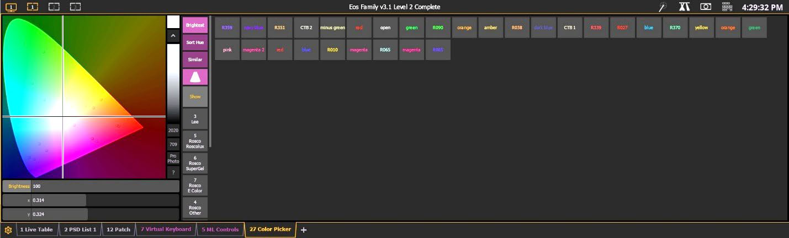

# ETC Eos: Color Picker and gel swatches

[Reference index](../README.md) · [Offline gallery](../index.html)

- Source: [ETC Eos manufacturer material](https://www.etcconnect.com/uploadedFiles/Main_Site/Documents/Public/Video_Tutorial/Eos_Family_L1_Essentials_v3.3.pdf)
- Asset: [original image or manual](https://www.etcconnect.com/uploadedFiles/Main_Site/Documents/Public/Video_Tutorial/Eos_Family_L1_Essentials_v3.3.pdf)
- Version/context: Level 1 Essentials workbook V3.3C; reused older screen illustrations
- Locator: PDF page 30 (one-based), embedded figure xref 120
- Stored dimensions: 1429 × 432 px
- Acquisition and visual inspection: 2026-10-06
- Processing: Complete embedded manual figure extracted to PNG; no UI crop or enlargement; RGB conversion where required
- SHA-256: `0d8ebe71f98b2492ff9795f8cdac33bb1fb2fbb3d5c29b663fdd18dc57d65ffa`
- Rights: third-party manufacturer reference; no open redistribution licence established. See [source register](../SOURCES.md).

## Screen purpose

Compare a chromaticity-based colour editor and named gel/preset swatches with the circular Titan picker.

## Visible layout

A horseshoe-shaped chromaticity graphic and triangular gamut region occupy the left quarter. A vertical brightness control and preset/filter category buttons sit alongside it. Two rows of labelled colour swatches span the top-right area; most of the lower-right area is empty dark grey. Brightness and x/y numerical fields are below the plot. A bottom tab bar identifies 27 Color Picker.

## Visible controls and data

Visible coordinates read x 0.314 and y 0.324, with Brightness 100. Buttons include Brightest, Sort Hue and Similar. Swatches include named colours and gel-style identifiers such as R359, R351 and CTB2. The category rail includes Lee and several Rosco families. Other open tabs include Live Table, PSD List, Patch, Virtual Keyboard and ML Controls.

## Visual hierarchy and state markings

The colour diagram carries most visual weight, while dark labelled swatches offer repeatable named choices. A crosshair spans the plot. Yellow/orange tab outlines identify the active workspace, and the category buttons introduce another colour hierarchy. Names and exact coordinates complement the graphical region.

## Workflow supported by the reference

Select a colour space/category, choose a named swatch or graph location, and inspect coordinates/brightness. The diagram is not a promise that every selected fixture can reproduce that point. The screenshot title contains Eos Family v3.1 Level 2 Complete, older than the workbook used.

## Design implications for our desk

A future Lightdesk picker can show supported gamut, named palette references and exact requested coordinates when Lux provides them. Keep colour distinct from intensity and display mixed fixture capability or gamut clipping. Do not promise physical spectral/gel equivalence from a coloured screen sample.

## Evidence limits

V3.3C workbook, PDF page 30; historical v3.1-labelled screen, 1429×432. Some small swatch names are soft. No colour measurement, fixture profile validation or physical output was performed.

The observations describe the retained picture. Design implications are proposals, not accepted product requirements or proof of engine capability.
