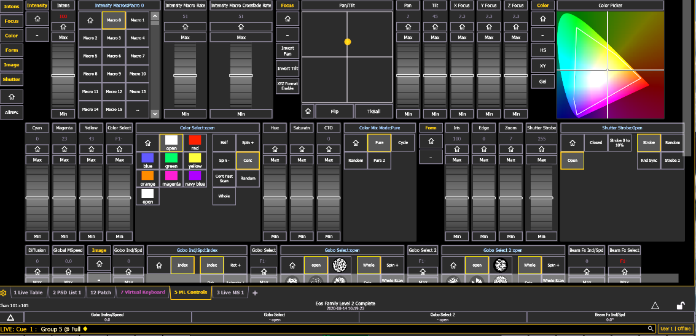

# ETC Eos: Moving-light Controls

[Reference index](../README.md) · [Offline gallery](../index.html)

- Source: [ETC Eos manufacturer material](https://www.etcconnect.com/uploadedFiles/Main_Site/Documents/Public/Video_Tutorial/Eos_Family_L1_Essentials_v3.3.pdf)
- Asset: [original image or manual](https://www.etcconnect.com/uploadedFiles/Main_Site/Documents/Public/Video_Tutorial/Eos_Family_L1_Essentials_v3.3.pdf)
- Version/context: Level 1 Essentials workbook V3.3C; reused older screen illustrations
- Locator: PDF page 34 (one-based), embedded figure xref 150
- Stored dimensions: 1133 × 548 px
- Acquisition and visual inspection: 2026-10-06
- Processing: Complete embedded manual figure extracted to PNG; no UI crop or enlargement; RGB conversion where required
- SHA-256: `7814b79af43c4a09664e3c7f7854ae6e18991b91766af8b40884fcef5a7ba191`
- Rights: third-party manufacturer reference; no open redistribution licence established. See [source register](../SOURCES.md).

## Screen purpose

Study an attribute-rich moving-light editor that mixes continuous controls, discrete choices and graphical tools.

## Visible layout

A left category rail lists Intens, Focus, Color, Form, Image, Shutter and AllNPs. The top region combines intensity/macro controls, a Pan/Tilt square with a yellow point, focus/XYZ sliders and a chromaticity picker. The next region contains colour-component sliders, colour selection/mix tiles, iris/edge/zoom and shutter controls. A lower gobo/beam region extends to the bottom of the viewport, above tabs and command/context bands.

## Visible controls and data

Continuous controls use vertical sliders with Home/Max/Min-style buttons. Discrete tiles include named colours, Open/Closed, strobe options and gobo choices. The bottom tabs identify ML Controls and the command band includes a Live cue/group context. Small labels and numeric values compete in a dense matrix; not every parameter can be read at normal thumbnail size.

## Visual hierarchy and state markings

Grey framed controls form a strong modular grid. Yellow text and selection outlines identify active sections/options, while the colour picker provides the largest saturated area. The design places many capabilities on one page, sacrificing whitespace and label size. Repeated slider patterns reduce learning but make scope mistakes possible without persistent identity.

## Workflow supported by the reference

Choose a category and fixture/channel scope, then use the corresponding continuous or discrete control. The image illustrates capability breadth; it does not establish the application rules, supported fixture personality or output ownership of every tile.

## Design implications for our desk

Use capability-aware groups and a consistent editor grammar in Lightdesk, with a larger selected-attribute inspector and actual units. Keep channel scope, programmer/held state and pending operation visible. Limit the default page to common band-rig controls and move advanced beam/gobo/XYZ detail behind explicit navigation.

## Evidence limits

V3.3C workbook, PDF page 34; older Eos Family Level 2 Complete screenshot with a 2020 date, 1133×548. The lower editor is cropped by the original viewport. Not a current-version guarantee or tested hardware workflow.

The observations describe the retained picture. Design implications are proposals, not accepted product requirements or proof of engine capability.
