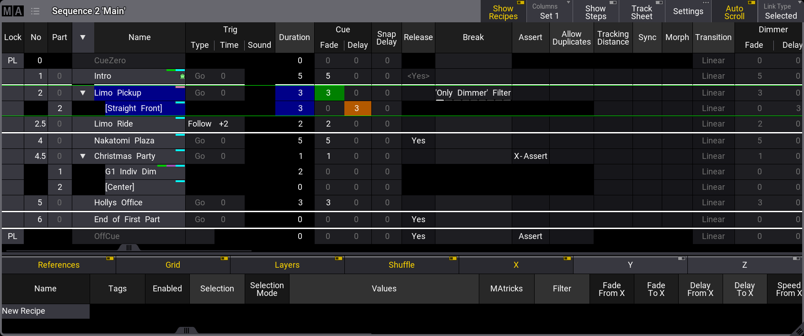

# MA Lighting grandMA3: Sequence Sheet, normal view

[Reference index](../README.md) · [Offline gallery](../index.html)

- Source: [MA Lighting grandMA3 manufacturer material](https://help.malighting.com/grandMA3/2.4/HTML/cue_sequence_sheet.html)
- Asset: [original image or manual](https://help.malighting.com/grandMA3/2.4/Storage/grandma3-user-manual-publication/img/window_sequence-sheet_v2-2.png)
- Version/context: Manual 2.4; illustration filename v2-2
- Locator: Complete source image
- Stored dimensions: 1758 × 738 px
- Acquisition and visual inspection: 2026-10-06
- Processing: Unmodified manufacturer PNG
- SHA-256: `c68a305cc97158a4c8bd1b7339f0cfa1264f6b291608162591cc15fd3708ce41`
- Rights: third-party manufacturer reference; no open redistribution licence established. See [source register](../SOURCES.md).

## Screen purpose

Inspect cue order, trigger/timing fields and the active cue while retaining an optional recipe-detail region.

## Visible layout

The title identifies Sequence 2 Main. A wide table has columns for number/part/name, trigger type/time/sound, duration, cue fade/delay, release, break/assert, tracking and other settings. Cue parts appear indented under parent cues. A lower region shows recipe tabs such as References, Grid, Layers, Shuffle, X, Y and Z, with an empty New Recipe row. View/settings controls remain in the upper right.

## Visible controls and data

Cue 2 Limo Pickup is blue and bounded by green active-cue lines. Its duration/fade fields read 3; a nested Straight Front part shows an orange delay 3. Other named cues include Intro, Limo Ride, Nakatomi Plaza, Christmas Party, Hollys Office and End of First Part. A Follow +2 trigger is visible. CueZero and OffCue are separately represented at the table boundaries.

## Visual hierarchy and state markings

Dark alternating rows, grey headers and explicit indentation organize a wide settings table. Blue selection, green activity/fade marks and orange timing emphasis have different roles. The title remains fixed even though far-right columns are clipped. Recipe detail is separated vertically from the main sequence.

## Workflow supported by the reference

Inspect the active cue and next ordered cues, then enter timing/part detail if needed. The manual identifies cue 2 as active; the image itself is a static capture and does not show a fade progressing or a GO button press.

## Design implications for our desk

Lightdesk Playback should make active, selected and next cues separately readable, with names and timing visible before GO. Keep advanced recipe/tracking fields out of the first default page. Cue clocks, part evaluation and confirmation must remain Lux-owned. Scrolling or selecting a row must not trigger playback.

## Evidence limits

Manual 2.4 reuses a v2-2-named image, 1758×738. Many advanced settings are shown but not operated. This establishes table organization, not real cue timing, priority or physical output.

The observations describe the retained picture. Design implications are proposals, not accepted product requirements or proof of engine capability.
