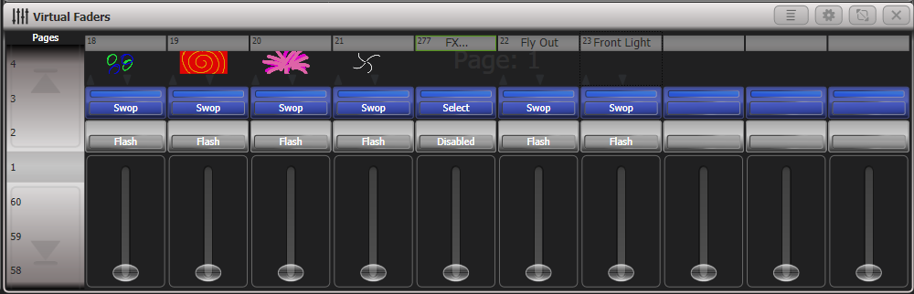

# Avolites Titan: Virtual Playbacks

[Reference index](../README.md) · [Offline gallery](../index.html)

- Source: [Avolites Titan manufacturer material](https://manual.avolites.com/docs/17.0/running-the-show/playback-controls/)
- Asset: [original image or manual](https://manual.avolites.com/assets/images/Virtual-Faders-481aebb6dac431abf05174af90713421.png)
- Version/context: Manual 17.0
- Locator: Complete source image
- Stored dimensions: 1000 × 322 px
- Acquisition and visual inspection: 2026-10-06
- Processing: Unmodified manufacturer PNG
- SHA-256: `5ce85b4090dd335832f3f028c8b84aea51ad1e0faa4e1298af8584a4c0abf10c`
- Rights: third-party manufacturer reference; no open redistribution licence established. See [source register](../SOURCES.md).

## Screen purpose

Study an on-screen playback bank that mirrors physical faders and momentary playback buttons.

## Visible layout

The Virtual Faders title sits above ten vertical slots. A left Pages column has page numbers and large up/down arrow areas. Each slot has a number/name or thumbnail header, two blue button rows, a grey Flash-style row and a long fader track. Page: 1 is faintly visible behind the upper area. Window controls are in the title bar.

## Visible controls and data

Headers include FX..., Fly Out and Front Light, while early slots use colourful thumbnails. Most blue buttons read Swop; the FX slot reads Select. Most grey buttons read Flash, but one is Disabled. All visible fader caps sit at the bottom. Several unlabelled rightmost slots remain present as empty bank positions.

## Visual hierarchy and state markings

Raised button graphics and large fader tracks preserve a strong hardware analogy. Blue buttons and grey momentary buttons encode function families, while cue thumbnails communicate look identity. The pale vertical page rail is separate from the dark playback bank. Empty slots retain geometry rather than collapsing the bank.

## Workflow supported by the reference

Choose a playback page, identify a named slot, then use its fader or button. The image does not establish whether the lowest fader position releases every attribute, nor how Swop/Flash interact with other playbacks; those policies require engine semantics.

## Design implications for our desk

Lightdesk can use stable numbered playback slots, explicit assigned/unassigned state and large readable action labels. Reflect actual controller mappings beside slots and show playback owner, active cue and pending action. Separate selection from firing, and show disabled operations plainly. Do not assume a zero fader means no programmer/held output.

## Evidence limits

Titan 17.0 manual, complete 1000×322 PNG. This is a virtual bank window rather than a full show workspace. No console, fader, cue or physical light was operated, and the screenshot does not define our playback arbitration policy.

The observations describe the retained picture. Design implications are proposals, not accepted product requirements or proof of engine capability.
